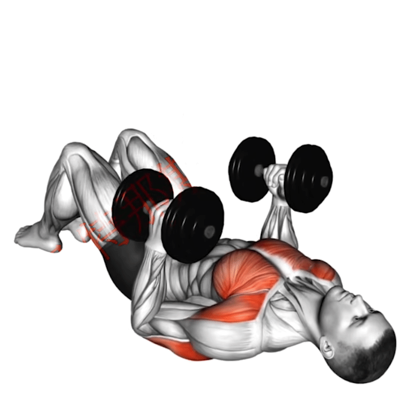

-----

| Title     | 健身 哑铃                                          |
| --------- | ---------------------------------------------- |
| Created @ | `2023-01-27T04:54:10Z`                         |
| Updated @ | `2023-06-17T12:41:48Z`                         |
| Labels    | \`\`                                           |
| Edit @    | [here](https://github.com/junxnone/l/issues/4) |

-----

# 哑铃健身

## 步行练习

  - 双手手持哑铃自然下垂
  - 原地踏步行走，双臂呈自然摆动

## 对握肩宽卧推

## Reference

  - [一对哑铃练完全身，哑铃居家全身分化训练计划，哑铃全身训练合集](https://www.bilibili.com/video/BV1ZP4y1a7GQ/)
