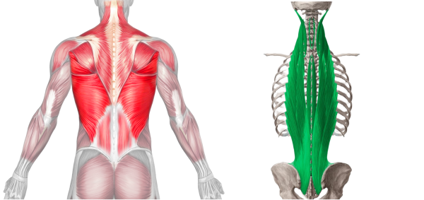

-----

| Title     | 健身 哑铃 弯腰哑铃划船                                    |
| --------- | ----------------------------------------------- |
| Created @ | `2023-07-25T17:12:19Z`                          |
| Updated @ | `2023-07-25T17:32:41Z`                          |
| Labels    | \`\`                                            |
| Edit @    | [here](https://github.com/junxnone/l/issues/15) |

-----

# 弯腰哑铃划船

  - 抓住两个哑铃，双脚分开与肩同宽站立，手掌相对，抓住哑铃
  - 保持背部挺直的同时，稍微弯曲膝盖并向前倾斜，使脊柱与地板成 45-90 度

## 错误姿势

  - 让手臂一直垂下，然后将重物笔直向上拉
  - 保持肘部靠近身体，将哑铃举至腰部，将肩胛骨挤压在一起

## 好处

  - 弯腰哑铃划船有利于解决肌肉不平衡问题，并且有助于纠正身体左右两侧之间可能存在的不对称
  - 竖脊肌，也称为竖脊肌，在脊柱两侧垂直向下延伸到整个背部

## Reference

  - [BENT OVER DUMBBELL
    ROW](https://fitnessprogramer.com/exercise/bent-over-dumbbell-row)
