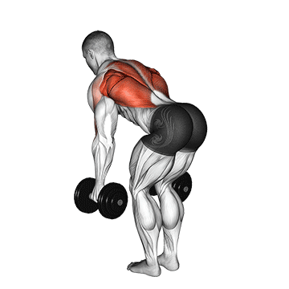

-----

| Title     | 健身 哑铃 弯腰哑铃划船                                    |
| --------- | ----------------------------------------------- |
| Created @ | `2023-07-25T17:12:19Z`                          |
| Updated @ | `2023-07-25T17:12:19Z`                          |
| Labels    | \`\`                                            |
| Edit @    | [here](https://github.com/junxnone/l/issues/15) |

-----

# 弯腰哑铃划船

  - 抓住两个哑铃，双脚分开与肩同宽站立，手掌相对，抓住哑铃
  - 保持背部挺直的同时，稍微弯曲膝盖并向前倾斜，使脊柱与地板成 45-90 度

## 错误姿势

